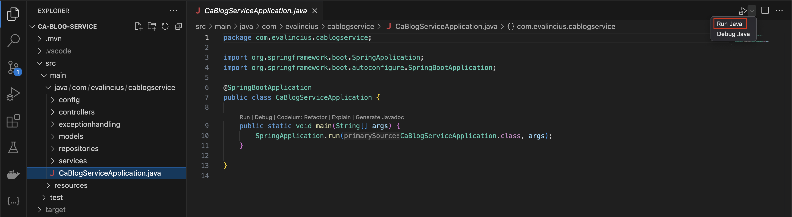
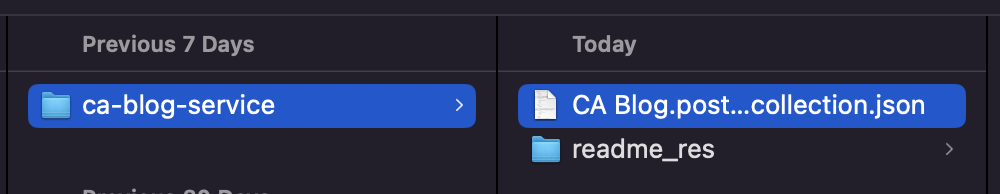
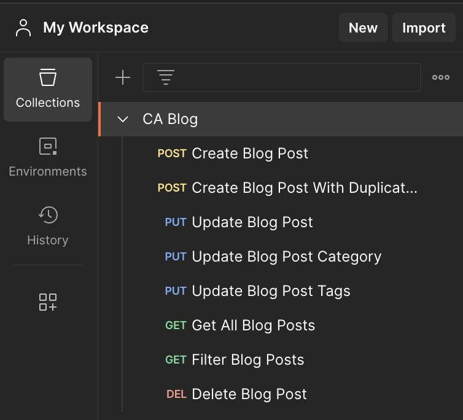

# CA Blog Service 

## Description

CA Blog Service is an application that provides a set of REST APIs to manage a single blog website.

## Application Functionality
- Can create a new Blog Post
    - Can select exisiting Category, Author and Tags by providing their ids while creating a new Blog Post
- Can Update Blog Post data
- Can Update Blog Post Tags
- Can Update Blog Post Category
- Can get all Blog Posts
- Blog Posts are filtered by:
    - Title 
    - If at least one Category matches
    - If at least one Tag matches
- Admins can delete Blog Posts

## How To Start Application

### To Start Application Localy
-   Install and launch MySQL please follow official guide:
    https://dev.mysql.com/doc/mysql-getting-started/en/
- Start MySQL server on port 3306 with `root` user and root password: `admin`(Note, for local testing ONLY!)
- Run Spring Boot application in VSCode. Open the source file where main method is defined and click Run on editor window.

### To Start Application Using Docker
- Make sure you have Docker installed on your machine.
- Open Terminal and CD to the location of `ca-blog-service` project.
- Run `docker compose up`

## Postman Collection
- Open Postman.
- Import Postman Collection
    - Select File > Import
    - Select `CA Blog.postman_collection.json`
        
- You should see the following Requests imported:
     

## Actuator URLs
-   http://localhost:8090/actuator
-   http://localhost:8090/actuator/health

## Swagger URL
-   http://localhost:8090/swagger-ui/index.html

